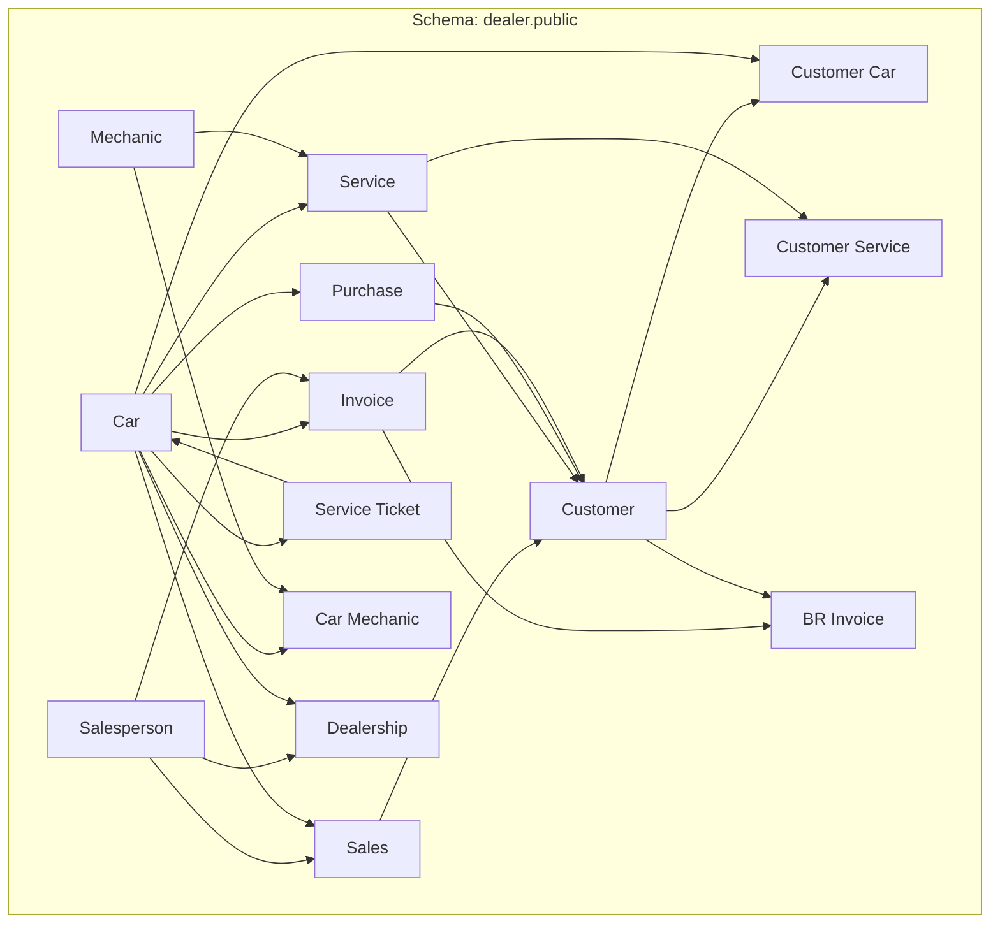

<!DOCTYPE html>
<html>

<head>
    <title>Dealer SQL Project</title>
    <style>
    body { 
font-size: 85.7%
}
h1 {
font-size: 3rem;
color: #eec64f;
}
h2 { 
font-size : 2rem;
color: #007e7e;
}
p {
font-size: 1rem;

}
</style>
</head>

<body>

<h1>Dealer SQL Project</h1>

<p>First, we will brainstorm some ideas.
    We have the following specifications so far...</p>

<ul>
    <li><code>Use PDF with an ERD</code></li>
    <li><code>The ERD in PDF</code></li>
    <li><code>SQL code that would be used to create the new database (DDL, DML).</code></li>
    <li><code>Also, once the database and the tables are created, each person should have AT LEAST 2 pieces
            records of data inside of the tables. (You can add more if you want)</code></li>
</ul>

<hr>

<p>So far we know we need three files: <code>ERD</code>, <code>DDL</code>, and <code>DML</code>.</p>

<hr>

<h2>Week 4 - ERD Assignment</h2>

<h4><i>USE ERD to Create SQL Database</i></h4>

<blockquote>
 <header>Instructions: <hr></header>
Create an ERD for a car dealership. The dealership sells both new and used cars,
and it operates a service facility.<br>
Base your design on the following business rules:
</blockquote>
By the previous approach im thinking in a single table for `<car table>` since in one column you can filter from new to old.
having two table here for each condition of new vs old is useless because you would extend the piece of code to join this tables
<blockquote>

### Lets think about this very quick

> In the world of data and SQL, bytes are like speed enhancers. When creating tables, we're like puzzle solvers,
> fitting data into compact capsules (1 to 4 bytes). Our goal? Super efficiency!
>
> Think big – even though we're handling a hundred lines now, reality involves millions or billions of data pieces
> daily. Writing massive code? It's like slowing down a Ferrari from 1ms to 2s.
>
> So, we're the data tailors, crafting sleek bytes for lightning-fast operations. Efficiency is our game, whether it's a
> hundred lines or a million pieces. 🚀🔍
</blockquote>

<p>So far i can see three department</p>
<ul>
<li>Sales</li>
<li>staff</li
<li>customer</li
</ul>


<code>

```postgresql

CREATE TABLE salesperson (
    salesperson_id SERIAL PRIMARY KEY,
    salesperson_name VARCHAR(100) NOT NULL,
    salesperson_email VARCHAR(100) UNIQUE NOT NULL,
    salesperson_phone_number VARCHAR(20) NOT NULL,
    created_at TIMESTAMP DEFAULT CURRENT_TIMESTAMP
);

CREATE TABLE Car (
    car_id SERIAL PRIMARY KEY,
    make VARCHAR(50) NOT NULL,
    model VARCHAR(50) NOT NULL,
    year INTEGER NOT NULL,
    customer_id INT NOT NULL,
    price DECIMAL(10, 2) NOT NULL,
    condition VARCHAR(255) NOT NULL,
    dealership_id INT,
    created_at TIMESTAMP DEFAULT CURRENT_TIMESTAMP,
    vin VARCHAR(17) UNIQUE NOT NULL,
    FOREIGN KEY (dealership_id) REFERENCES dealership(dealership_id)
);

CREATE TABLE dealership (
    dealership_id SERIAL PRIMARY KEY,
    name VARCHAR(30),
    location VARCHAR(100)
);

CREATE TABLE customer (
    customer_id SERIAL PRIMARY KEY,
    first_name VARCHAR(50) NOT NULL,
    last_name VARCHAR(50) NOT NULL,
    email VARCHAR(100) UNIQUE NOT NULL,
    phone_number VARCHAR(20) NOT NULL,
    date_of_birth DATE NOT NULL,
    created_at TIMESTAMP DEFAULT CURRENT_TIMESTAMP
);

CREATE TABLE sales (
    sales_id SERIAL PRIMARY KEY,
    salesperson_id INT NOT NULL,
    car_id INT NOT NULL,
    sale_date TIMESTAMP DEFAULT CURRENT_TIMESTAMP,
    FOREIGN KEY (salesperson_id) REFERENCES salesperson (salesperson_id),
    FOREIGN KEY (car_id) REFERENCES car (car_id)
);

CREATE TABLE Service (
    service_id SERIAL PRIMARY KEY,
    car_id INTEGER REFERENCES Car(car_id),
    service_name VARCHAR(100) NOT NULL,
    description TEXT,
    customer_id INTEGER REFERENCES Customer(customer_id),
    service_date DATE NOT NULL,
    service_description TEXT NOT NULL,
    service_cost DECIMAL(10, 2) NOT NULL,
    created_at TIMESTAMP DEFAULT CURRENT_TIMESTAMP
);

CREATE TABLE purchase (
    purchase_id SERIAL PRIMARY KEY,
    customer_id INT NOT NULL,
    car_id INT NOT NULL,
    purchase_date TIMESTAMP DEFAULT CURRENT_TIMESTAMP,
    FOREIGN KEY (customer_id) REFERENCES customer (customer_id),
    FOREIGN KEY (car_id) REFERENCES car (car_id)
);

CREATE TABLE invoice (
    invoice_id SERIAL PRIMARY KEY,
    salesperson_id INT NOT NULL,
    car_id INT NOT NULL,
    sale_date DATE NOT NULL,
    total_price DECIMAL(10, 2) NOT NULL,
    invoice_date TIMESTAMP DEFAULT CURRENT_TIMESTAMP,
    created_at TIMESTAMP DEFAULT CURRENT_TIMESTAMP,
    FOREIGN KEY (customer_id) REFERENCES customer (customer_id),
    FOREIGN KEY (salesperson_id) REFERENCES salesperson (salesperson_id),
    FOREIGN KEY (car_id) REFERENCES car (car_id)
);

CREATE TABLE customer_car (
    customer_car_id SERIAL PRIMARY KEY,
    customer_id INT NOT NULL,
    car_id INT NOT NULL,
    created_at TIMESTAMP DEFAULT CURRENT_TIMESTAMP,
    FOREIGN KEY (customer_id) REFERENCES customer (customer_id),
    FOREIGN KEY (car_id) REFERENCES car (car_id)
);

CREATE TABLE customer_service (
    customer_service_id SERIAL PRIMARY KEY,
    customer_id INT NOT NULL,
    service_id INT NOT NULL,
    service_date DATE NOT NULL,
    created_at TIMESTAMP DEFAULT CURRENT_TIMESTAMP,
    FOREIGN KEY (customer_id) REFERENCES customer (customer_id),
    FOREIGN KEY (service_id) REFERENCES service (service_id)
);

CREATE TABLE service_ticket (
    ticket_id SERIAL PRIMARY KEY,
    car_id INT NOT NULL,
    service_date DATE NOT NULL,
    service_description TEXT,
    created_at TIMESTAMP DEFAULT CURRENT_TIMESTAMP,
    FOREIGN KEY (car_id) REFERENCES car (car_id)
);

CREATE TABLE mechanic (
    mechanic_id SERIAL PRIMARY KEY,
    mechanic_name VARCHAR(100) NOT NULL,
    mechanic_email VARCHAR(100) UNIQUE NOT NULL,
    mechanic_phone_number VARCHAR(20) NOT NULL,
    created_at TIMESTAMP DEFAULT CURRENT_TIMESTAMP
);

CREATE TABLE car_mechanic (
    car_mechanic_id SERIAL PRIMARY KEY,
    car_id INT NOT NULL,
    mechanic_id INT NOT NULL,
    created_at TIMESTAMP DEFAULT CURRENT_TIMESTAMP,
    FOREIGN KEY (car_id) REFERENCES Car (car_id),
    FOREIGN KEY (mechanic_id) REFERENCES mechanic (mechanic_id)
);

```
</code>



[//]: # (A salesperson may sell many cars, but each car is sold by only one salesperson.)
[//]: # (A customer may buy many cars, but each car is purchased by only one customer.)
[//]: # (A salesperson writes a single invoice for each car he or she sells.)
[//]: # (A customer gets an invoice for each car he or she buys.)
[//]: # (A customer may come in just to have his or her car serviced; that is, a customer need not buy a car to be classified as)

[//]: # (a customer.)
[//]: # ([//]: # &#40;When a customer takes one or more cars in for repair or service, one service ticket is written for each car.&#41;)
[//]: # (The car dealership maintains a service history for each of the cars serviced. The service records are referenced by the)

[//]: # (car’s serial number.)
[//]: # (A car brought in for service can be worked on by many mechanics, and each mechanic may work on many cars.)

After the tables have been created, use SQL to add data to the database

Each person will need to create their own SQL database.
~~~

</body>

</html>